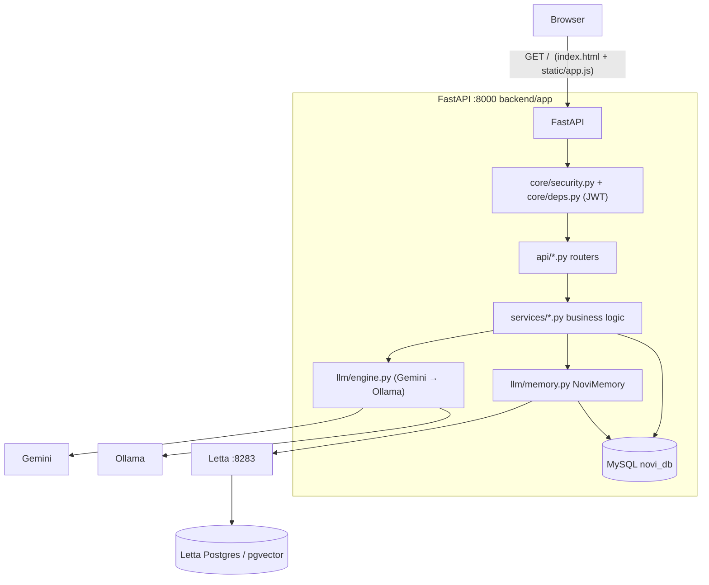
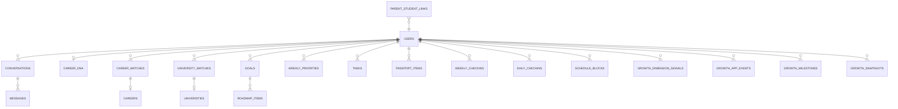
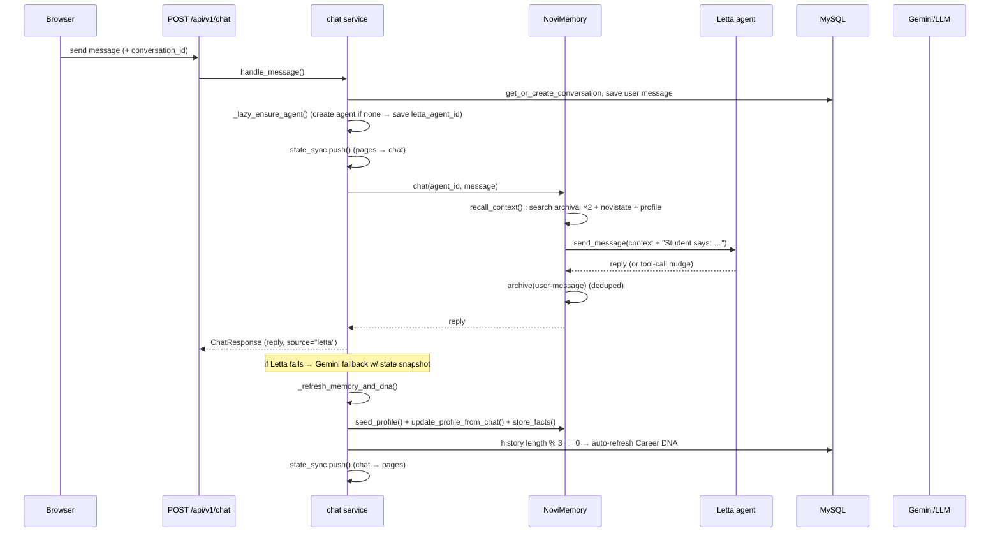
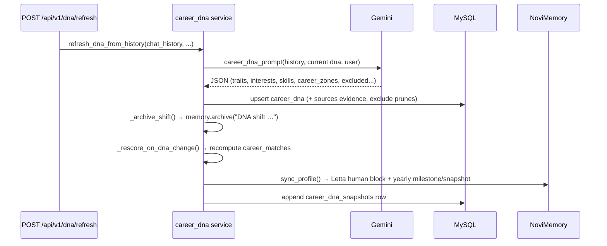
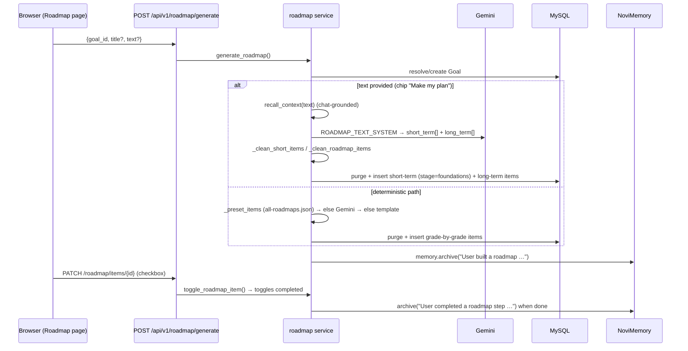

# NOVI - AI Student Mentor

An AI-powered chat interface for student guidance and career discovery.

## Tech Stack

- **Backend**: FastAPI (Python)
- **Database**: MySQL + Letta (for AI memory)
- **AI**: Google Gemini API (free tier)
- **Frontend**: HTML/CSS/JavaScript

## Prerequisites

1. **Docker Desktop** - Install from https://www.docker.com/products/docker-desktop
2. **Python 3.10+** - Already installed
3. **Gemini API Key** - Get free from https://makersuite.google.com/app/apikey

## Quick Start

### 1. Get Gemini API Key (Free)

1. Go to https://makersuite.google.com/app/apikey
2. Sign in with Google account
3. Click "Create API Key"
4. Copy the key

### 2. Update Environment Variables

Edit `backend/.env` and replace `your_gemini_api_key_here` with your actual API key:

```
GEMINI_API_KEY=AIzaSyxxxxxxxxxxxxxxxxxxxxxx
```

### 3. Start Services with Docker

```bash
# From the project root
docker-compose up -d
```

This starts:
- MySQL database (port 3306)
- Letta server (port 8283)
- Redis (port 6379)

### 4. Install Python Dependencies

```bash
# Activate virtual environment
source venv/bin/activate

# Install dependencies
pip install -r backend/requirements.txt
```

### 5. Start the Application

```bash
# From the project root
cd backend
source ../venv/bin/activate
python main.py
```

> 📖 For the memory & recall system (how NOVI remembers students across
> Grades 9–12, storage locations, dedup, caching, and operational commands)
> see **`MEMORY_SYSTEM.md`**.

### 6. Open the Application

Open your browser and go to:
```
http://localhost:8000
```

## Project Structure

```
novi_tech_app/
├── docker-compose.yml      # Docker services (MySQL, Letta, Redis)
├── backend/
│   ├── main.py            # FastAPI application
│   ├── database.py        # Database connection
│   ├── models.py          # SQLAlchemy models
│   ├── schemas.py         # Pydantic schemas
│   ├── services/
│   │   ├── letta_service.py   # Letta AI memory integration
│   │   ├── gemini_service.py  # Gemini API integration
│   │   └── auth_service.py    # Authentication
│   ├── init.sql           # Database schema
│   ├── requirements.txt   # Python dependencies
│   └── .env              # Environment variables
├── frontend/
│   ├── index.html         # Main chat interface
│   └── static/
│       ├── styles.css     # Styling
│       └── app.js         # Frontend logic
└── README.md
```

## API Endpoints

| Method | Endpoint | Description |
|--------|----------|-------------|
| POST | `/api/auth/signup` | Create new account |
| POST | `/api/auth/login` | Login |
| POST | `/api/chat` | Send message |
| GET | `/api/conversations/{user_id}` | Get conversations |
| GET | `/api/conversations/{id}/messages` | Get messages |
| GET | `/api/user/{id}/career-dna` | Get Career DNA |
| POST | `/api/user/{id}/goals` | Create goal |
| GET | `/api/user/{id}/goals` | Get goals |

## Features

- ✅ Chat with AI mentor (Novi)
- ✅ Persistent conversations
- ✅ User authentication
- ✅ Career DNA profile
- ✅ Goals management
- ✅ Career Passport
- ✅ Modern, responsive UI

## Troubleshooting

### MySQL Connection Error
Make sure Docker is running:
```bash
docker-compose ps
```

### Letta Not Available
The app will fall back to Gemini directly if Letta is not available.

### Port Already in Use
Change the port in the uvicorn command:
```bash
uvicorn main:app --port 8001
```

## Next Steps

After MVP, you can add:
- Weekly check-ins
- University explorer
- Career matching
- Parent dashboard
- Admin panel

---

# Internal Documentation

This section documents how NOVI actually works internally: the system architecture,
every database table, and the end-to-end data flows. It is maintained to match the
code in `backend/` and `frontend/`.

- [1. System Architecture](#1-system-architecture)
- [2. Database Schema](#2-database-schema)
- [3. Data Flow](#3-data-flow)

---

## 1. System Architecture

### 1.1 Component overview

NOVI is a **FastAPI** application with two persistent data stores:

- **MySQL (`novi_db`)** — the authoritative, relational database for the whole app
  (users, chat history, career DNA, passport, roadmap, planner, growth). Tables are
  created by SQLAlchemy `Base.metadata.create_all` (no Alembic migrations).
- **Letta (per-student agent memory)** — a long-term "memory brain" run in its own
  Docker container (`letta/letta:latest`, port `8283`), backed by a dedicated
  PostgreSQL + pgvector database (`novi_letta_db`). Each student has ONE Letta agent
  whose ID is persisted in `users.letta_agent_id`, so memory survives across sessions.

Supporting services via `docker-compose.yml`:

| Service        | Container         | Port | Role                                        |
|----------------|-------------------|------|---------------------------------------------|
| Letta          | `novi_letta`      | 8283 | Per-student agent, archival + core memory   |
| Letta Postgres | `novi_letta_db`   | 5432 | Letta's own vector store (pgvector)         |
| Redis          | `novi_redis`      | 6379 | Provisioned; not currently used by app code |

The API also talks to two LLM backends:

| Provider | URL                                     | Role                                             |
|----------|-----------------------------------------|--------------------------------------------------|
| Google Gemini   | external API | Primary model for extraction, matching, summaries |
| Ollama (local)  | `http://localhost:11434/v1` | Fallback LLM + Letta agent model + embeddings |



### 1.2 High-level request lifecycle

1. The browser calls an endpoint under `/api/v1/...` with a `Bearer` JWT.
2. `core/deps.py` decodes the token (`core/security.py`), loads the `User`, and enforces
   role (`get_current_student` / `get_current_parent`).
3. The router invokes a service in `app/services/` (or `app/m3/services/`), which does
   DB work through SQLAlchemy and reaches out to the LLM through `app/services/providers.py`
   singletons (`gemini`, `letta`, `memory`).
4. Responses re-sync app state back into Letta via `app/services/state_sync.py` so chat
   and pages stay consistent.

### 1.3 Config & environment

All settings live in `backend/app/core/config.py` (`pydantic-settings`) and are overridden
by `backend/.env`:

| Key | Default | Meaning |
|-----|---------|---------|
| `DB_*` | `localhost:3306 root / novi_db` | MySQL connection |
| `SECRET_KEY` / `JWT_ALGORITHM` | `novi-secret-key...` / `HS256` | Token signing |
| `ACCESS_TOKEN_EXPIRE_MINUTES` | 10080 (7d) | JWT lifetime |
| `GEMINI_API_KEY` / `GEMINI_MODEL` | `` / `gemini-3.6-flash` | Primary LLM |
| `OLLAMA_BASE_URL` / `OLLAMA_MODEL` | `http://localhost:11434/v1` / `llama3.2:3b` | Fallback LLM |
| `LETTA_BASE_URL` / `LETTA_ENABLED` | `http://localhost:8283` / `true` | Memory server |
| `LETTA_MODEL` | `ollama/llama3.2:3b` | Model driving each agent |

### 1.4 Frontend: Next.js app + legacy bundle

- **Next.js app (current)**: `frontend/` is a Next.js (App Router) React app — a client-side
  SPA for auth/API (token in `localStorage`, `next.config.mjs` proxies `/api/*` and
  `/static/*` to the backend). Routes live in `frontend/app/` as thin gated wrappers around
  the page components in `frontend/src/views/`. Run with `npm --prefix frontend run dev`
  (http://localhost:3000) or `next build && next start` for production.
- **Legacy bundle**: the backend also serves the single-file vanilla bundle
  (`frontend/index.html` no longer exists — the legacy JS `frontend/static/app.js` + CSS
  remain under `frontend/static/` and are served by FastAPI at `/` and `/static/*`).

### 1.5 Resilience & fallbacks

- **LLM engine** (`app/llm/engine.py` → `NoviEngine`) tries Gemini first, falls back to
  Ollama for text and JSON; every service call is wrapped so a provider outage degrades
  gracefully instead of erroring.
- **Letta-down archive**: `memory.archive()` checks reachability and silently returns
  `False` rather than throwing; a missing `letta_agent_id` is auto-provisioned and
  persisted back to the user row.
- **Roadmap / passport / check-in generation**: JSON generation falls back to deterministic
  templates (`_template_roadmap`, `_template_short`, `_fallback_priorities`, etc.) when the
  LLM fails.
- **Dedup**: archival dedup is never authoritative-blocking — if the dedup check itself
  fails it proceeds to save.

---

## 2. Database Schema

Database name: **`novi_db`** (MySQL, InnoDB). For every table the SQLAlchemy model lives
in `backend/app/models/*.py` (legacy app) or `backend/app/m3/db/models/*.py` (module-3).
Enums are defined in `backend/app/models/enums.py`.

### 2.1 Overview



### 2.2 Legacy (app) tables

#### `users` — accounts & identities
`id` PK · `email` unique · `password_hash` (bcrypt) · `role` (student|parent) ·
`first_name` · `last_name` · `grade` (9–12) · `school` · `avatar` · `is_active` ·
**`letta_agent_id`** (bridge to the student's Letta agent) · `created_at` · `updated_at`
Relations: conversations, dna, matches, goals, roadmap_items, priorities, tasks, items,
checkins, and (via `parent_student_links`) linked children/parents.

#### `parent_student_links` — parent–child binding
`id` PK · `parent_id` FK→users · `student_id` FK→users · `label` · `created_at`

#### `conversations` — chat threads
`id` PK · `user_id` FK→users · `title` · `created_at` · `updated_at`

#### `messages` — chat turns
`id` PK · `conversation_id` FK→conversations · `role` (user|assistant|system) ·
`content` (Text) · `created_at`

#### `careers` — static career catalog (seeded)
`id` PK · `slug` unique · `title` · `category` · `emoji` · `summary` · `description` ·
`what_they_do` · `skills` (JSON) · `subjects` (JSON) · `degrees` (JSON) ·
`industries` (JSON) · `future_paths` (JSON) · `salary_range` · `outlook` ·
`ranking_profile` · `country_rankings` (JSON) · `created_at`

#### `career_matches` — per-student scored matches
`id` PK · `user_id` FK→users · `career_id` FK→careers · `score` (0–100) · `rank` ·
`reasons` (JSON) · `matched_at`

#### `career_dna` — the student's living profile (one per user)
`id` PK · `user_id` FK→users **unique** · `traits`/`motivations`/`strengths`/
`development_areas`/`interests`/`subjects`/`skills`/`career_zones`/`values`/`goals`
(all JSON lists) · `novi_reflection` (Text) · `dna_filled` (bool) ·
`sources` (JSON — evidence: `{field: [{value, quote, conversation_id}]}`) ·
`excluded` (JSON — moved-away topics) · `created_at` · `updated_at`

#### `career_dna_snapshots` — versioned timeline of the DNA
Same DNA column set plus `label` (e.g. "My DNA · age 16"), `note`, `created_at`(idx), `updated_at`.

#### `passport_items` — the student's achievement passport
`id` PK · `user_id` FK→users · `category` (projects|competitions|certifications|
leadership|research|activities|achievements) · `title` · `description` ·
`skills` (JSON) · `date_achieved` · `certificate_url` · `verified` (bool) ·
`created_at` · `updated_at`

#### `weekly_checkins` — weekly reflection
`id` PK · `user_id` FK→users · `week_start` (Date) · `accomplishments` · `learnings` ·
`challenges` · `pride` · `next_week` (all Text) · `ai_summary` (JSON
`{"wins", "skills", "milestones", "priorities"}`) · `status` (draft|submitted|summarized) ·
`created_at` · `updated_at`

#### `goals` — student goals
`id` PK · `user_id` FK→users · `title` · `description` · `category`
(career|university|academic|extracurricular|personal) · `status` (active|completed|paused)
· `target_date` · `created_at` · `updated_at`

#### `roadmap_items` — steps in a goal's roadmap (the "nodes")
`id` PK · `user_id` FK→users · `goal_id` FK→goals (nullable) · `grade` (9–12) ·
`stage` (discover|explore|build|apply|**foundations**) · `title` · `description` ·
`category` (build|explore|grow) · `order_index` · **`completed`** (bool — the checkbox
state) · `created_at`

#### `weekly_priorities` — this week's 3 priorities
`id` PK · `user_id` FK→users · `week_start` (Date) · `ordinal` (1–3) ·
`skill_category` (build|explore|grow) · `title` · `minutes` · `completed` · `created_at`

#### `tasks` — free-standing to-do items
`id` PK · `user_id` FK→users · `title` · `description` · `category` ·
`status` (todo|doing|done) · `due_date` · `source` · `created_at`

#### `daily_checkins` — planner daily reflection
`id` PK · `user_id` FK→users · `date` · `focus` · `done` · `mood` · `energy` · `note` ·
`ai_summary` (JSON) · `status` (draft|submitted|summarized) · `created_at` · `updated_at`

#### `schedule_blocks` — time-blocked planner entries
`id` PK · `user_id` FK→users · `date` · `start_time`/`end_time` (Time) · `title` · `kind`
(study|task|priority|class|exam|coach|break) · `minutes` · `source` (manual|auto) ·
`linked_type`/`linked_id` (reference back to source item) · `completed` · `order_index` ·
`created_at` · `updated_at`

#### `universities` — static university catalog (seeded)
`id` PK · `slug` unique · `name` · `country` · `city` · `course` · `subject` · `ranking` ·
`fees_per_year` · `university_type` · `scholarships` (bool) · `entry_requirements` ·
`about` · `website` · `tags` (JSON) · `strengths` (JSON) · `courses` (JSON) ·
`rankings` (JSON) · `created_at`

#### `university_matches` — per-student readiness
`id` PK · `user_id` FK→users · `university_id` FK→universities · `course` ·
`readiness` (0–100) · `strengths`/`improvements`/`next_steps` (JSON) · `created_at`

#### Growth tables (`app/models/growth.py`)
- **`growth_dimension_signals`** — `id` PK · `user_id` FK · `dimension`
  (interest|strength|skill|zone|goal|motivation|value|trait) · `label` ·
  `signal_value` (0–100) · `confidence_before`/`confidence_after` · `delta` ·
  `source` (onboarding|dna|dna_decay|backfill|manual) · `source_ref` · `created_at`
- **`growth_app_events`** — `id` PK · `user_id` FK · `event_type`
  (e.g. `passport_projects`, `roadmap_step_done`) · `title` · `tags` (JSON) · `created_at`
- **`growth_milestones`** — `id` PK · `user_id` FK · `source_type`
  (roadmap_item|priority|task|custom) · `source_id` · `title` · `status`
  (pending|done|skipped) · `self_rated_helpful` · `created_at` · `completed_at`
- **`growth_snapshots`** — `id` PK · `user_id` FK · `snapshot_date` (unique per user/day
  via `uq_growth_snapshot_day`) · `payload` (JSON — per-dimension confidence) ·
  `event_count` · `created_at`

### 2.3 Module-3 (m3) subsystem

The `app/m3/` package is a second-generation domain layer: UUID-keyed tables, its own
services/repositories, exposed under `/api/v1/m3`. It is **bridged** to the legacy schema
by `app/services/m3_bridge.py` so legacy features and m3 views stay consistent.

#### `m3_students`
`id` (UUID PK) · `user_id` (int, **unique** — join to `users.id`) · `external_id` (unique) ·
`created_at` · `updated_at`

#### `m3_goals`
`id` (UUID PK) · `student_id` FK→m3_students · `goal_type` · `title` · `description` ·
`target_date` · `status` · `priority` · `career_id` FK→m3_careers (nullable) ·
`career_match_id` FK→m3_career_matches (nullable) · `created_at` · `updated_at`

#### `m3_roadmaps`
`id` (UUID PK) · `goal_id` FK→m3_goals · `title` · `description` · `start_date` ·
`target_date` · `status` (draft…) · `created_at` · `updated_at`

#### `m3_milestones`
`id` (UUID PK) · `roadmap_id` FK→m3_roadmaps · `title` · `description` · `start_date` ·
`target_date` · `status` · `order_index` · `created_at` · `updated_at`

#### `m3_tasks`
`id` (UUID PK) · `milestone_id` FK→m3_milestones · `title` · `description` · `start_date` ·
`target_date` · `status` · `priority` · `order_index` · `created_at` · `updated_at`

#### `m3_weekly_checkins`
`id` (UUID PK) · `roadmap_id` FK→m3_roadmaps · `week_start_date` (unique per roadmap/week) ·
`accomplished` · `learned` · `challenged` · `proud_of` · `improve_next` · `created_at` ·
`updated_at`

#### `m3_careers`
`id` (UUID PK) · `name` · `slug` · `description` · `category` · `industry` ·
`experience_level` · `metadata_json` · **`embedding`** (JSON list — vector for semantic match) ·
`is_active` · `created_at` · `updated_at`

#### `m3_career_skills` / `m3_career_tags`
Join tables tying careers to `m3_skills` (with `importance`, `required_level`, `is_core`)
and to tag strings.

#### `m3_skills` / `m3_student_skills`
Skill catalog + per-student proficiency (`level`, `confidence`, `source`, `updated_at`).

#### `m3_discovery_runs` / `m3_career_matches`
Discovery runs capture a matching pass (`career_dna_version`, `thread_id`, `trigger`,
`status`, timestamps). `m3_career_matches` stores per-career scores with a check constraint
locking `tag_score`/`semantic_score`/`ai_score`/`final_score` to `[0, 1]`, plus `rank` and
`why_fit` (JSON).

#### `m3_bridge` (`app/services/m3_bridge.py`)
- `ensure_m3_student` — create/lookup the `m3_students` row for a legacy `users.id`.
- `sync_goal_to_m3` — copy legacy `goals` into `m3_goals`.
- `generate_and_activate_roadmap` — run the m3 roadmap generator on an m3 goal, then
  `mirror_roadmap_to_legacy` writes matching `roadmap_items` rows (legacy).
- `sync_item_completion` / `reconcile_legacy_items` — propagate completion both ways
  (m3 task ↔ legacy `roadmap_items.completed`).
- `progress_percentage` / `active_roadmap_full` / `upcoming_tasks` / `resolve_task_chain` —
  read-side helpers used by the m3 API.

### 2.4 Letta memory store

Not MySQL — Letta's own PostgreSQL (`novi_letta_db`, user `novi_user`). Key concepts:

- **One agent per student**: created by `LettaClient.create_agent()`; agent IDs look like
  `agent-<uuid>`. Persisted at `users.letta_agent_id`.
- **Core memory blocks**: two blocks, `persona` (Novi's identity/persona prompt) and
  `human` (the evolving one-line student summary). Updated via
  `update_memory_block(agent_id, "human", text)`.
- **Archival memory passages**: each passage is `{text, tags}`. Tags include the source
  category (`chat`, `student`, `profile`, `milestone`, `roadmap`, `checkin`, `passport`, …)
  plus a **school-year tag** (`sy_2026-27` style, from `letta.sy_tag()`) and a **grade tag**
  (`grade11`).
- **State passage ("novistate")**: `state_sync.set_state()` keeps a single replaceable
  archival passage tagged `novistate` that mirrors the current DB snapshot, so chat always
  knows the live app state.
- **Dedup on insert** runs inside `LettaClient.insert_archival()`:
  1. Text normalization (lowercase, stop-phrase stripping, light stemming).
  2. **Word-overlap ≥ 0.8** → near-duplicate → skip.
  3. **Semantic tier** (`_semantic_is_near_identical`): Ollama `nomic-embed-text` embeddings,
     cosine **≥ 0.92** → collapse. Never throws; on failure it falls back to word-overlap only.

### 2.5 Seeding

- `backend/app/db/seeds.py` — idempotent (only when empty) insert of the `careers` and
  `universities` catalogs.
- `backend/app/db/init_db.py` — `python -m app.db.init_db` creates all tables (legacy +
  m3) and seeds; `--reset` drops everything first.

---

## 3. Data Flow

### 3.1 Chat → memory → DNA (the core loop)



Key details:

- **Recall**: `recall_context()` runs `search_archival` on the message **and** on profile
  keywords (`"interests goals skills progress milestones achievements"`), then prepends the
  `novistate` passage and the current `human` profile. Any failure returns `""` (chat still works).
- **Store facts**: `store_facts()` asks Gemini for `{facts: [...]}` and archives up to 5,
  tagged `student` + school-year + grade.
- **DNA refresh** every 3rd message (`_auto_refresh_dna`) → `refresh_dna_from_history()`
  (below).

### 3.2 Career DNA



- DNA can also be built from free text (`build_dna_from_text`) — same pipeline, different prompt.
- `dna_context()` / `dna_dict()` serialize the DNA for other LLM features (roadmap,
  priorities, check-in summaries, university readiness).

### 3.3 Passport (achievements)

- **Manual**: `POST /passport/items` → row in `passport_items` → `memory.archive(...)`.
- **Auto (refresh from chat)**: `refresh_from_chat()` pulls the user's chat history and
  existing items, runs Gemini `passport_extract_prompt`, and creates/updates passport items
  + archives new ones. Unchanged if extraction is skipped.

### 3.4 Roadmap (goals → grade-by-grade + short-term nodes)



- `GET /roadmap` splits `stage=foundations` items into a `short_term` list and the rest into
  `stages` keyed by grade.
- The generated items use the `roadmap_items` table; m3 generates its own roadmaps that are
  mirrored back to `roadmap_items` via the bridge.

### 3.5 Weekly priorities & tasks

- **Priorities**: `POST /roadmap/priorities/generate` → Gemini `weekly_priorities_prompt`
  (student + DNA + active goals + incomplete roadmap) → up to 3 `weekly_priorities` rows for
  the current week; fallback picks incomplete roadmap items.
- **Tasks**: `POST /roadmap/tasks` creates `tasks`; `PATCH /roadmap/tasks/{id}` flips status.

### 3.6 Check-ins

- `POST /checkins` saves a `weekly_checkins` row for the current week.
- `POST /checkins/summarize` runs Gemini `checkin_summary_prompt` → fills `ai_summary`, flips
  status to `summarized`, and archives the weekly milestone.

### 3.7 Growth signals & snapshots

- `record_signals_from_dna()` turns DNA fields into `growth_dimension_signals`
  (confidence before/after/delta, EWMA-style update via `update_confidence`).
- `record_event()` writes `growth_app_events` (e.g. passport additions, roadmap step done).
- `growth_milestones` track goal-ish milestones seeded from roadmap/priorities/tasks.
- `snapshot()` writes per-day `growth_snapshots` (unique per user+day); a nightly job
  (`app/jobs/growth_snapshot.py`) refreshes them; `confidence_velocity()` reports 90-day trend.

### 3.8 state_sync (pages ⇄ chat)

- **Pages → chat**: any roadmap/passport/task/check-in mutation calls `state_sync.push()`,
  which builds a compact snapshot from the DB (DNA, goals, roadmap %, priorities, tasks,
  passport, check-ins) and writes it to Letta as the replaceable `novistate` passage.
- **Chat → pages**: after each turn the same snapshot is re-pushed so the next render matches.

### 3.9 m3 bridge flows

- Legacy `goals` are copied to `m3_goals` (`sync_goal_to_m3`); m3 roadmaps are generated from
  m3 goals and mirrored to legacy `roadmap_items` (`mirror_roadmap_to_legacy`), so both UIs
  show the same plan.
- Completion syncs both ways (`sync_item_completion`, `reconcile_legacy_items`).
- `progress_percentage()` reads legacy `roadmap_items` for a goal and returns a 0–100 number.
